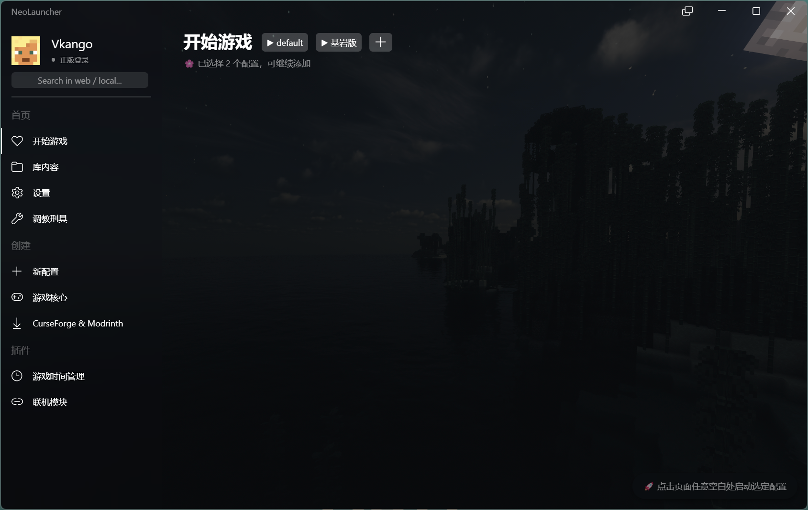

# ⭐ NeoLauncher

基于 Tauri + Vue3 开发的 Minecraft 启动器。

尚未完成。

# 📷 窗口截图

# 🚀 画饼列表

## 游戏相关

### 登录

- [ ] 离线登录
- [ ] 微软登录
- [ ] 刷新令牌

### 启动

- [ ] 启动游戏
- [ ] JVM 参数调节
- [ ] 自动寻找 Java

### 游戏核心下载

- [ ] Java版下载
- [ ] 基岩版下载

### 加载器

- [ ] OptiFine
- [ ] Fabric
- [ ] Forge
- [ ] NeoForge
- [ ] Quilt
- [ ] LiteLoader

### CurseForge & Modrinth 支持

- [ ] CurseForge
- [ ] Modrinth

## 启动器本体相关

### 外观

- [x] 基本页面
- [x] 明/暗主题
- [ ] 背景图更换
- [x] Acrylic / Mica 材质
- [x] 通知、弹窗、Toast、SnackBar

### 配置

- [ ] 单实例配置支持
- [ ] 多实例配置支持
- [ ] 库内容管理

### 后台任务

- [ ] 后台任务列表

### 插件

- [ ] 插件系统支持

# 💧感谢

NeoLauncher 的诞生离不开以下内容的支持！

[教程:编写启动器 - 中文 Minecraft Wiki](https://zh.minecraft.wiki/w/Tutorial:编写启动器?variant=zh-cn)

[Segoe Fluent 图标字体 - Windows apps | Microsoft Learn](https://learn.microsoft.com/zh-cn/windows/apps/design/style/segoe-fluent-icons-font)

[markedjs/marked: A markdown parser and compiler. Built for speed.](https://github.com/markedjs/marked)

[Grid布局实现不定高度的真瀑布流，只需几行代码 - 知乎](https://zhuanlan.zhihu.com/p/648073709)
